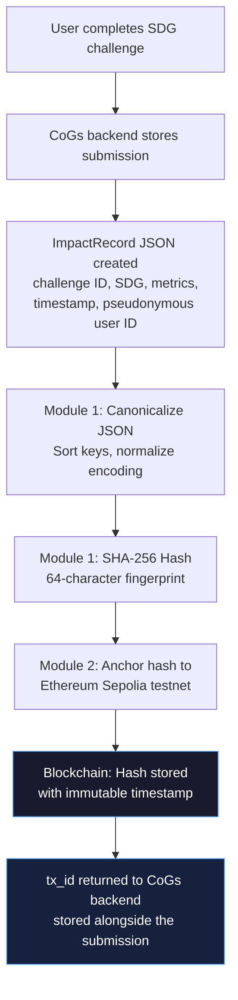
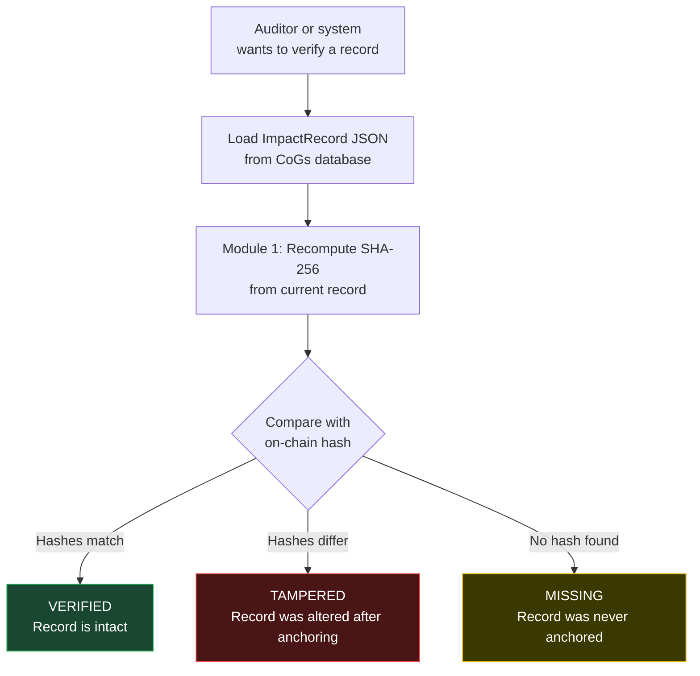
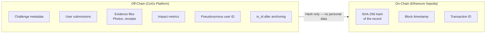
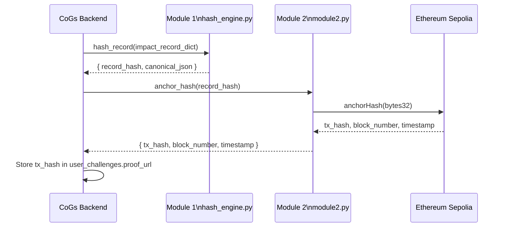

# Guardian Trust MVP — Handoff Document

**Project:** Guardian Trust
**Built for:** Community of Guardians (CoGs)
**Status:** MVP complete. Offline verification tested. Ready for Sepolia deployment.
**Date:** March 2026

---

## What This Project Is

Community of Guardians runs an SDG challenge platform where users complete real-world sustainability actions and submit proof. The problem: how do you know submitted records haven't been silently edited after the fact? How can a sponsor or auditor trust that a verified record is the same one the user originally submitted?

Guardian Trust is a blockchain-backed integrity layer built to answer that question.

It does one thing: **prove that a submission existed at a specific point in time and has not been altered since.**

It is not a replacement for the CoGs platform. It is a trust layer that sits alongside it.

---

## How It Proves SDG Submissions Are Real and Untampered

### The Core Idea

When a user completes an SDG challenge, their submission data is turned into a standardized JSON record. That record is hashed using SHA-256 — a one-way mathematical fingerprint. The fingerprint is written to a public blockchain. Later, anyone can recompute the fingerprint from the record and compare it to what's on the blockchain.

If the record was changed after anchoring — even a single character — the fingerprint will be completely different. The mismatch is instant and mathematically certain.

### The Full Trust Flow



### Verification Flow



### Why This Works

- **Deterministic:** The same JSON record always produces the exact same hash. There is no randomness.
- **Immutable:** Once a hash is written to the blockchain, it cannot be changed or deleted.
- **Public:** Anyone with the transaction ID can look up the hash on a public blockchain explorer.
- **Independent:** Verification doesn't require trusting CoGs, this team, or any platform. The math is public.

---

## What Is Stored Where



**Personal data never touches the blockchain.** Names, emails, photos, and raw records all stay off-chain in the CoGs system. Only the 64-character fingerprint is anchored.

---

## What This Repo Does and Does Not Do

### What it does

- Generates a canonical, deterministic hash of an ImpactRecord (Module 1)
- Deploys a minimal smart contract to Ethereum Sepolia and anchors the hash (Module 2)
- Verifies whether a given record matches its on-chain hash (Module 3)
- Detects tampering instantly — any change to the record produces a different hash
- Runs fully offline for testing and demos without any blockchain connection
- Works with the CoGs database schema (`user_challenges` table) as the intended integration point

### What it does not do

- **Does not verify the submission itself** — it only proves the record hasn't changed since it was anchored. It cannot tell you whether the user actually did the thing they claimed.
- **Does not store any data** — it only stores a fingerprint on the blockchain. All actual data stays in CoGs.
- **Does not replace human review** — Guardian Trust is a tamper-evidence layer, not an automated approver.
- **Does not run in production** — this is a testnet prototype. The contract is deployed to Sepolia (fake ETH, not real money). Production deployment to Ethereum mainnet would require real costs and additional security review.
- **Does not have a UI** — interaction is via Python CLI or the demo script. A web interface would need to be built separately.
- **Does not integrate with CoGs automatically** — CoGs would need to call Module 1 and Module 2 as part of their submission pipeline (see Integration section below).
- **Does not handle evidence verification** — photos and receipts are referenced by ID only. The system does not check whether they're authentic.

---

## How CoGs Would Integrate This

This is the CoGs team's responsibility to implement, but here is the integration surface.

There are two moments in the CoGs pipeline where Guardian Trust plugs in:

### Moment 1 — After a challenge is verified/approved

When a submission is confirmed, the CoGs backend should:

1. Construct an ImpactRecord JSON from the `user_challenges` row
2. Call Module 1 (`hash_record()`) to get the SHA-256 hash
3. Call Module 2 (`anchor_hash()`) to write the hash to Sepolia
4. Store the returned `tx_id` (transaction hash) back into `user_challenges.proof_url` or a dedicated column



### Moment 2 — During verification / audit

When a record needs to be verified:

1. Load the ImpactRecord from the database
2. Call Module 3 (`verifier.py`) with the record and the stored `tx_id`
3. Module 3 returns `VERIFIED`, `TAMPERED`, or `MISSING`
4. Store result in `user_challenges.verified_by`, `verified_at`, `verification_notes`

### Database Columns Already Set Up for This

The CoGs `user_challenges` table already has columns that map directly:

| Column | Guardian Trust Usage |
|--------|---------------------|
| `proof_url` | Store Sepolia explorer URL after anchoring |
| `verified_by` | Set to `"guardian_trust"` after verification |
| `verified_at` | Timestamp when verification ran |
| `verification_notes` | Store `"VERIFIED"` / `"TAMPERED"` + hashes |

---

## What Could Be Explored or Upgraded

The three of us who built this are not blockchain experts. The system works, and the architecture is sound. But there is a lot of room to go deeper. Here's an honest list:

### Near-term (without much new blockchain knowledge)

**1. Replace simulation with real deployment**
The contract is compiled and ready. The only missing step is running the deploy script with a funded test wallet. This is the highest-priority next step before any real use.

**2. Add a simple web API**
Wrap Module 3 in a Flask or FastAPI endpoint so CoGs can call `POST /verify` and get a result without running a CLI command. No blockchain knowledge needed — just Python web dev.

**3. Automate anchoring in the CoGs pipeline**
Right now anchoring is manual. A developer on the CoGs side would wire Module 1 and Module 2 into their existing submission approval flow.

**4. Anchor in bulk / batch**
Instead of anchoring one hash at a time, hash multiple records and anchor a Merkle root (the combined fingerprint of many records). This is more efficient and cheaper on mainnet. Requires some reading on Merkle trees.

### Longer-term (requires more blockchain research)

**5. Move to Ethereum mainnet (production)**
Sepolia is a testnet — transactions are free but not permanent in the same way. A real deployment would use Ethereum mainnet or a cheaper Layer 2 like Arbitrum or Optimism. This costs real money per transaction and requires proper key management.

**6. Use a cheaper / faster chain**
Ethereum Sepolia was chosen for simplicity and documentation. In production, a Layer 2 chain (Polygon, Arbitrum, Base) would be significantly cheaper per transaction. The code would need minor changes to point at a different RPC endpoint.

**7. IPFS for evidence**
Currently evidence is referenced by file ID only. A future version could store a hash of the evidence file itself on IPFS, providing a decentralized content-addressable reference. This is a larger change and requires understanding IPFS.

**8. Multi-party anchoring**
Currently only the CoGs platform anchors hashes. A more decentralized model would allow third-party verifiers (scientists, auditors) to independently anchor their own confirmation. This is a design question more than a code question.

**9. Zero-knowledge proofs**
Advanced research direction: prove something about a record (e.g., "this user's CO2 reduction exceeds 10kg") without revealing the full record. Requires significant cryptography expertise — not a near-term thing.

---

## Current Limitations to Be Aware Of

| Limitation | Notes |
|------------|-------|
| Testnet only | Sepolia hashes are not permanent in the same way as mainnet. For production use, mainnet deployment is required. |
| Module 2 not yet live | The contract deploy script is ready but has not been run against real Sepolia. Test ETH and a private key are needed. |
| No key management | The `PRIVATE_KEY` is passed as an environment variable. For any real deployment, use a proper secrets manager (AWS Secrets Manager, HashiCorp Vault, etc.). |
| No retry / error handling | If an anchoring transaction fails (network issue, out of gas), the system doesn't automatically retry. |
| CLI only | There is no web UI or API endpoint yet. |
| Single-record anchoring | One blockchain transaction per record. Batch anchoring via Merkle tree would be more efficient at scale. |

---

## Repository at a Glance

```
guardian-trust-mvp/
│
├── readme.md                   Project overview and architecture
├── SETUP.md                    How to run and deploy
├── requirements.txt            Python dependencies (web3)
│
├── demo_end_to_end.py          Run this to see everything working
│
├── module1/
│   ├── hash_engine.py          Core: canonicalize + SHA-256 hash
│   └── impact_record.py        ImpactRecord dataclass definition
│
├── module 2/
│   └── module2.py              Deploy contract + anchor hash to Sepolia
│
├── module 3/
│   ├── verifier.py             CLI: verify a record against on-chain hash
│   ├── sample_record.json      Example ImpactRecord (original)
│   └── sample_record_tampered.json  Example with one field changed
│
└── docs/
    ├── architecture.md         Full module breakdown + mermaid flow
    ├── IMPACT_RECORD_SCHEMA.md Field spec and canonicalization rules
    ├── on-off-chain.md         Why data is split between chain and database
    └── blockchain-decision.md  Why Ethereum Sepolia was chosen
```

---

## Immediate Next Steps

In priority order:

1. **Deploy the contract to Sepolia**
   Get test ETH, run the deploy script in `module 2/module2.py`, save the contract address. See `SETUP.md` for exact steps.

2. **Update `verifier.py` with the deployed contract address**
   One line change: `CONTRACT_ADDRESS = "0x..."` — the `TODO` is clearly marked in the file.

3. **Run a live end-to-end test**
   Anchor a real record, then verify it using `--tx <tx_hash>` mode. Confirm VERIFIED status.

4. **Hand integration surface to CoGs**
   Share this document and `SETUP.md` with the CoGs backend team. They need to call `hash_record()` and `anchor_hash()` at the point in their pipeline where a submission is approved.

5. **Decide on production path**
   If this goes into real use: choose a production chain (mainnet or L2), set up proper key management, wrap in an API.

---

## Closing Note

This system does not eliminate the need for human judgment. It cannot tell you whether a user's sustainability action was meaningful, well-evidenced, or real. What it does is guarantee that once a record is approved and anchored, it cannot be quietly changed without detection.

The trust here is narrow but strong: **the record you see now is the record that was anchored.**

That is the guarantee. Everything else — quality, evidence review, scoring — remains the responsibility of the CoGs platform.
